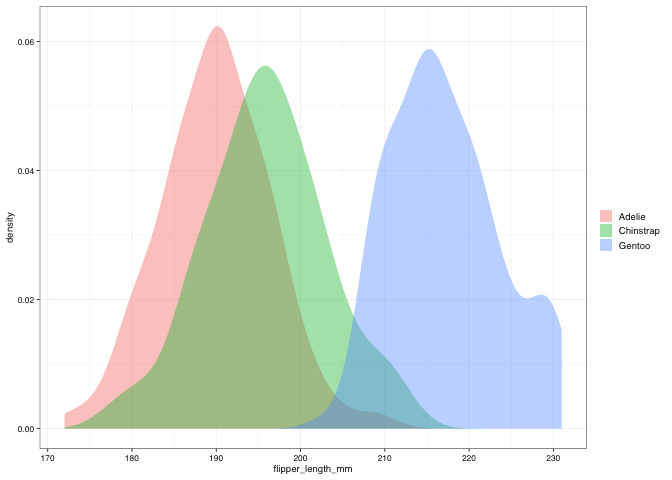
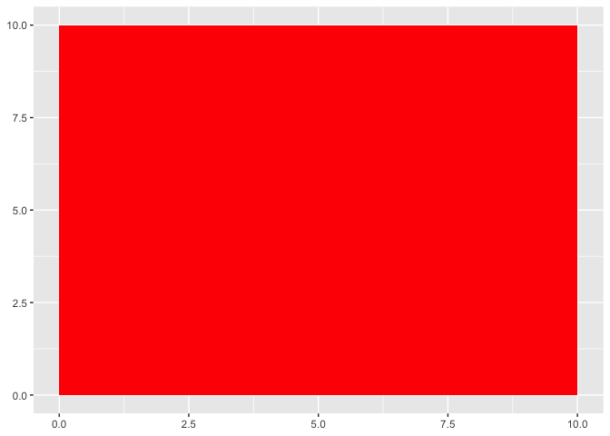
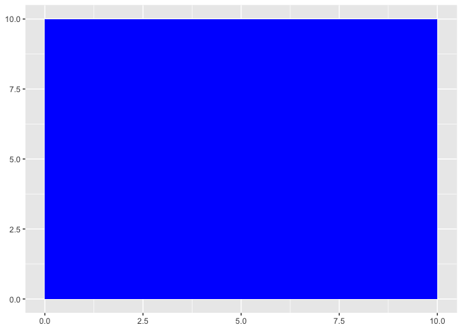
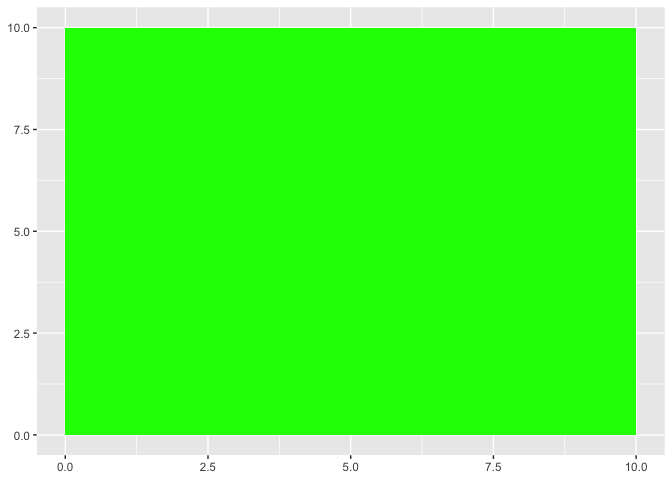

# Conditionals

Sometimes you need to calculate something, or change a vaue based on a certain contion (e.g. the value of  adifferent column).

We have already seen in class one a aproach to this, `case_when()`, today we are going to revist that one and see some other options.

## Using `case_when()`


```r
penguins %>% 
  ggplot() + 
  geom_density(aes(flipper_length_mm, fill = species), alpha = 0.4, colour = NA) +
  theme_pepe()
```

```
## Warning: Removed 2 rows containing non-finite values (stat_density).
```

<!-- -->


```r
penguins %>% 
  mutate(fliper_group = case_when(
    flipper_length_mm <= 190 ~ "Short",
    190 < flipper_length_mm & flipper_length_mm <= 210 ~ "Medium",
    flipper_length_mm > 210 ~ "Long",
  ))
```

```
## # A tibble: 344 x 9
##    species island bill_length_mm bill_depth_mm flipper_length_… body_mass_g
##    <fct>   <fct>           <dbl>         <dbl>            <int>       <int>
##  1 Adelie  Torge…           39.1          18.7              181        3750
##  2 Adelie  Torge…           39.5          17.4              186        3800
##  3 Adelie  Torge…           40.3          18                195        3250
##  4 Adelie  Torge…           NA            NA                 NA          NA
##  5 Adelie  Torge…           36.7          19.3              193        3450
##  6 Adelie  Torge…           39.3          20.6              190        3650
##  7 Adelie  Torge…           38.9          17.8              181        3625
##  8 Adelie  Torge…           39.2          19.6              195        4675
##  9 Adelie  Torge…           34.1          18.1              193        3475
## 10 Adelie  Torge…           42            20.2              190        4250
## # … with 334 more rows, and 3 more variables: sex <fct>, year <int>,
## #   fliper_group <chr>
```


```r
penguins %>% 
  mutate(fliper_group = case_when(
    flipper_length_mm <= 190 ~ "Short",
    190 < flipper_length_mm & flipper_length_mm <= 210 ~ "Medium",
    TRUE ~ "Long",
  ))
```

```
## # A tibble: 344 x 9
##    species island bill_length_mm bill_depth_mm flipper_length_… body_mass_g
##    <fct>   <fct>           <dbl>         <dbl>            <int>       <int>
##  1 Adelie  Torge…           39.1          18.7              181        3750
##  2 Adelie  Torge…           39.5          17.4              186        3800
##  3 Adelie  Torge…           40.3          18                195        3250
##  4 Adelie  Torge…           NA            NA                 NA          NA
##  5 Adelie  Torge…           36.7          19.3              193        3450
##  6 Adelie  Torge…           39.3          20.6              190        3650
##  7 Adelie  Torge…           38.9          17.8              181        3625
##  8 Adelie  Torge…           39.2          19.6              195        4675
##  9 Adelie  Torge…           34.1          18.1              193        3475
## 10 Adelie  Torge…           42            20.2              190        4250
## # … with 334 more rows, and 3 more variables: sex <fct>, year <int>,
## #   fliper_group <chr>
```

## Using `if_else()`


```r
penguins %>% 
  mutate(fliper_group = if_else(flipper_length_mm <= 190, "Short", "Not short"))
```

```
## # A tibble: 344 x 9
##    species island bill_length_mm bill_depth_mm flipper_length_… body_mass_g
##    <fct>   <fct>           <dbl>         <dbl>            <int>       <int>
##  1 Adelie  Torge…           39.1          18.7              181        3750
##  2 Adelie  Torge…           39.5          17.4              186        3800
##  3 Adelie  Torge…           40.3          18                195        3250
##  4 Adelie  Torge…           NA            NA                 NA          NA
##  5 Adelie  Torge…           36.7          19.3              193        3450
##  6 Adelie  Torge…           39.3          20.6              190        3650
##  7 Adelie  Torge…           38.9          17.8              181        3625
##  8 Adelie  Torge…           39.2          19.6              195        4675
##  9 Adelie  Torge…           34.1          18.1              193        3475
## 10 Adelie  Torge…           42            20.2              190        4250
## # … with 334 more rows, and 3 more variables: sex <fct>, year <int>,
## #   fliper_group <chr>
```


```r
penguins %>% 
  mutate(fliper_group = if_else(flipper_length_mm <= 190, "Short",
                                if_else(190 < flipper_length_mm & flipper_length_mm <= 210, "Medium", "Short")))
```

```
## # A tibble: 344 x 9
##    species island bill_length_mm bill_depth_mm flipper_length_… body_mass_g
##    <fct>   <fct>           <dbl>         <dbl>            <int>       <int>
##  1 Adelie  Torge…           39.1          18.7              181        3750
##  2 Adelie  Torge…           39.5          17.4              186        3800
##  3 Adelie  Torge…           40.3          18                195        3250
##  4 Adelie  Torge…           NA            NA                 NA          NA
##  5 Adelie  Torge…           36.7          19.3              193        3450
##  6 Adelie  Torge…           39.3          20.6              190        3650
##  7 Adelie  Torge…           38.9          17.8              181        3625
##  8 Adelie  Torge…           39.2          19.6              195        4675
##  9 Adelie  Torge…           34.1          18.1              193        3475
## 10 Adelie  Torge…           42            20.2              190        4250
## # … with 334 more rows, and 3 more variables: sex <fct>, year <int>,
## #   fliper_group <chr>
```

Both `case_when()` and `if_else()` are vectorized function. They are very *picky* with the outputs that they give, they really do not like mixing classes, so all posible outputs need to be the same class (e.g. doubles, strings, etc). Unfortunately that includes mixing numbers or strings with **NA**

For example, lets say that we wante dto include another group to cover any other lengths outside of our range and asign those an NA.


```r
penguins %>% 
  mutate(fliper_group = case_when(
    flipper_length_mm <= 190 ~ "Short",
    190 < flipper_length_mm & flipper_length_mm <= 210 ~ "Medium",
    flipper_length_mm > 210 ~ "Long",
    TRUE ~ NA
  ))
```

That doesn't work, because the NA is being considered of a different class than the text


```r
penguins %>% 
  mutate(fliper_group = if_else(flipper_length_mm <= 190, "Short",
                                if_else(190 < flipper_length_mm & flipper_length_mm <= 210, "Medium",
                                        if_else(flipper_length_mm > 210, "Long", NA))))
```
in the same manner, that doesn't work, because the NA is being considered of a different class than the text


## Base R `ifelse()`


```r
penguins %>% 
  mutate(fliper_group = ifelse(flipper_length_mm <= 190, "Short",
                                ifelse(190 < flipper_length_mm & flipper_length_mm <= 210, "Medium",
                                        ifelse(flipper_length_mm > 210, "Long", NA))))
```

```
## # A tibble: 344 x 9
##    species island bill_length_mm bill_depth_mm flipper_length_… body_mass_g
##    <fct>   <fct>           <dbl>         <dbl>            <int>       <int>
##  1 Adelie  Torge…           39.1          18.7              181        3750
##  2 Adelie  Torge…           39.5          17.4              186        3800
##  3 Adelie  Torge…           40.3          18                195        3250
##  4 Adelie  Torge…           NA            NA                 NA          NA
##  5 Adelie  Torge…           36.7          19.3              193        3450
##  6 Adelie  Torge…           39.3          20.6              190        3650
##  7 Adelie  Torge…           38.9          17.8              181        3625
##  8 Adelie  Torge…           39.2          19.6              195        4675
##  9 Adelie  Torge…           34.1          18.1              193        3475
## 10 Adelie  Torge…           42            20.2              190        4250
## # … with 334 more rows, and 3 more variables: sex <fct>, year <int>,
## #   fliper_group <chr>
```

This works. Now, there are good reasons why the tidiverse versions do what they do (e.g. prevent you from doing silly things), but if you really need to, this will allow you to.


## Complicating things, using base R's `if(){}else{}`

This is the most versatile option, however, as the most versatile, is also the more complicate dto handle.

One problem is that it is not vectorized. The main "problem" with this is that the condition it uses is going to be one single value, not a vector, and if you give it a vector, it is going to use only the first value.


```r
penguins %>% 
  mutate(flipper_group = 
           if(flipper_length_mm <= 190){"Short"}else{"Not short"}
           )
```

```
## Warning: Problem with `mutate()` input `flipper_group`.
## ℹ the condition has length > 1 and only the first element will be used
## ℹ Input `flipper_group` is `if (...) NULL`.
```

```
## Warning in if (flipper_length_mm <= 190) {: the condition has length > 1 and
## only the first element will be used
```

```
## # A tibble: 344 x 9
##    species island bill_length_mm bill_depth_mm flipper_length_… body_mass_g
##    <fct>   <fct>           <dbl>         <dbl>            <int>       <int>
##  1 Adelie  Torge…           39.1          18.7              181        3750
##  2 Adelie  Torge…           39.5          17.4              186        3800
##  3 Adelie  Torge…           40.3          18                195        3250
##  4 Adelie  Torge…           NA            NA                 NA          NA
##  5 Adelie  Torge…           36.7          19.3              193        3450
##  6 Adelie  Torge…           39.3          20.6              190        3650
##  7 Adelie  Torge…           38.9          17.8              181        3625
##  8 Adelie  Torge…           39.2          19.6              195        4675
##  9 Adelie  Torge…           34.1          18.1              193        3475
## 10 Adelie  Torge…           42            20.2              190        4250
## # … with 334 more rows, and 3 more variables: sex <fct>, year <int>,
## #   flipper_group <chr>
```


```r
test_df <- if(penguins$flipper_length_mm <= 190){"Short"}else{"Not short"}
```

```
## Warning in if (penguins$flipper_length_mm <= 190) {: the condition has length >
## 1 and only the first element will be used
```

```r
print(test_df)
```

```
## [1] "Short"
```


That means that in order to get the traditional `if(){}else{}` to work, e would need to "walk it" though the dataset. Good thing that we now know how to do that! Let's bring all the `map()` power on!


```r
penguins %>% 
  mutate(flipper_group = pmap_chr(list(flipper_length_mm),
                              ~if(is.na(..1)){NA}
                              else if(..1 <= 190){"Short"}
                              else if(190 <..1 & ..1 <= 210){"Medium"}
                              else{"Long"}))
```

```
## # A tibble: 344 x 9
##    species island bill_length_mm bill_depth_mm flipper_length_… body_mass_g
##    <fct>   <fct>           <dbl>         <dbl>            <int>       <int>
##  1 Adelie  Torge…           39.1          18.7              181        3750
##  2 Adelie  Torge…           39.5          17.4              186        3800
##  3 Adelie  Torge…           40.3          18                195        3250
##  4 Adelie  Torge…           NA            NA                 NA          NA
##  5 Adelie  Torge…           36.7          19.3              193        3450
##  6 Adelie  Torge…           39.3          20.6              190        3650
##  7 Adelie  Torge…           38.9          17.8              181        3625
##  8 Adelie  Torge…           39.2          19.6              195        4675
##  9 Adelie  Torge…           34.1          18.1              193        3475
## 10 Adelie  Torge…           42            20.2              190        4250
## # … with 334 more rows, and 3 more variables: sex <fct>, year <int>,
## #   flipper_group <chr>
```


Also, because the base `if(){}else{}` it allows for outputs that are more complicated, like model outputs, or plots!


```r
test_plots <- tibble(colour = c("red", "blue", "green")) %>% 
  mutate(plot = pmap(list(colour),
                     ~if(..1 == "red"){
                       ggplot() +
                         geom_rect(aes(xmin = 0, xmax = 10, ymin = 0, ymax = 10), fill = "red")
                     }else if(..1 == "blue"){
                       ggplot() +
                         geom_rect(aes(xmin = 0, xmax = 10, ymin = 0, ymax = 10), fill = "blue")
                     }else{
                       ggplot() +
                         geom_rect(aes(xmin = 0, xmax = 10, ymin = 0, ymax = 10), fill = "green")
                     }
  ))

test_plots$plot
```

```
## [[1]]
```

<!-- -->

```
## 
## [[2]]
```

<!-- -->

```
## 
## [[3]]
```

<!-- -->


# Loops

R doesn't care if you write something 1000 times or have it copy it 1000 times. The second is a lot easier for you


```r
i <- 2

i <- i + 2
i <- i + 2
i <- i + 2
i <- i + 2
i <- i + 2
i <- i + 2

print(i)
```

```
## [1] 14
```


or


```r
i <- 2

for (counter in 1:6){
  
  i <- i + 2
  
  print(i)
}
```

```
## [1] 4
## [1] 6
## [1] 8
## [1] 10
## [1] 12
## [1] 14
```


```r
penguins_pepe <- penguins
```


```r
penguins_pepe$flipper_group <- NA
```


```r
for(i in 1:length(penguins_pepe$flipper_length_mm)){
  
  penguins_pepe$flipper_group[i] <- if(is.na(penguins_pepe$flipper_length_mm[i])){NA}
  else if(penguins_pepe$flipper_length_mm[i] <= 190){"Short"}
  else if(190 < penguins_pepe$flipper_length_mm[i] & penguins_pepe$flipper_length_mm[i] <= 210){"Medium"}
  else{"Long"}

}


print(penguins_pepe)
```

```
## # A tibble: 344 x 9
##    species island bill_length_mm bill_depth_mm flipper_length_… body_mass_g
##    <fct>   <fct>           <dbl>         <dbl>            <int>       <int>
##  1 Adelie  Torge…           39.1          18.7              181        3750
##  2 Adelie  Torge…           39.5          17.4              186        3800
##  3 Adelie  Torge…           40.3          18                195        3250
##  4 Adelie  Torge…           NA            NA                 NA          NA
##  5 Adelie  Torge…           36.7          19.3              193        3450
##  6 Adelie  Torge…           39.3          20.6              190        3650
##  7 Adelie  Torge…           38.9          17.8              181        3625
##  8 Adelie  Torge…           39.2          19.6              195        4675
##  9 Adelie  Torge…           34.1          18.1              193        3475
## 10 Adelie  Torge…           42            20.2              190        4250
## # … with 334 more rows, and 3 more variables: sex <fct>, year <int>,
## #   flipper_group <chr>
```


# Functions


```r
short_flipper <- function(data = data){
  
  data$flipper_group <- NA
  
  for(i in 1:length(data$flipper_length_mm)){
    
    data$flipper_group[i] <- if(is.na(data$flipper_length_mm[i])){NA}
    else if(data$flipper_length_mm[i] <= 190){"Short"}
    else if(190 < data$flipper_length_mm[i] & data$flipper_length_mm[i] <= 210){"Medium"}
    else{"Long"}
  }
  
  print(data)
  
}
```


```r
penguins %>% 
  short_flipper()
```

```
## # A tibble: 344 x 9
##    species island bill_length_mm bill_depth_mm flipper_length_… body_mass_g
##    <fct>   <fct>           <dbl>         <dbl>            <int>       <int>
##  1 Adelie  Torge…           39.1          18.7              181        3750
##  2 Adelie  Torge…           39.5          17.4              186        3800
##  3 Adelie  Torge…           40.3          18                195        3250
##  4 Adelie  Torge…           NA            NA                 NA          NA
##  5 Adelie  Torge…           36.7          19.3              193        3450
##  6 Adelie  Torge…           39.3          20.6              190        3650
##  7 Adelie  Torge…           38.9          17.8              181        3625
##  8 Adelie  Torge…           39.2          19.6              195        4675
##  9 Adelie  Torge…           34.1          18.1              193        3475
## 10 Adelie  Torge…           42            20.2              190        4250
## # … with 334 more rows, and 3 more variables: sex <fct>, year <int>,
## #   flipper_group <chr>
```


