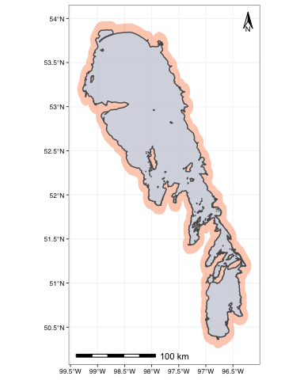

# Some resources

1. [Geocomputation with R](https://geocompr.robinlovelace.net/)
2. Nice [resource](https://thinking-spatial.org/courses/angewandte_geodatenverarbeitung/kurs06/) about the sf package


# Loading some data

We are going to use the dataset of water quality variables measuerd in Lake winnipeg in 2002-2004 that we used in previous classes:


```r
lw_data_original <- read_csv(here("data", "lake_winnipeg_chemistry_2002_2004.csv"))
```

```
## Parsed with column specification:
## cols(
##   .default = col_character(),
##   MonitoringLocationLatitude = col_double(),
##   MonitoringLocationLongitude = col_double(),
##   ActivityStartDate = col_date(format = ""),
##   ActivityStartTime = col_time(format = ""),
##   ActivityEndDate = col_logical(),
##   ActivityEndTime = col_logical(),
##   ActivityDepthHeightMeasure = col_double(),
##   SampleCollectionEquipmentName = col_logical(),
##   ResultValue = col_double(),
##   ResultDetectionQuantitationLimitMeasure = col_double(),
##   ResultAnalyticalMethodID = col_logical(),
##   ResultAnalyticalMethodContext = col_logical(),
##   AnalysisStartDate = col_logical(),
##   AnalysisStartTime = col_logical(),
##   AnalysisStartTimeZone = col_logical()
## )
```

```
## See spec(...) for full column specifications.
```


But now we need as well a `.shp` layer with lake Winnipeg. This was extracted from the government of Canada [Water File - Lakes and Rivers (polygons) - 2011 Census](https://open.canada.ca/data/en/dataset/448ec403-6635-456b-8ced-d3ac24143add)


```r
lake_winnipeg <- read_sf(here("data", "lw", "lw.shp"))

plot(lake_winnipeg, axes = TRUE)
```

<!-- -->


# Manipulating the data

We are going to clean up the water quality data and keep just the total phosphorus data for the surface depth in 2004


```r
lw_data <- lw_data_original %>% 
  clean_names() %>% 
  mutate(year = year(activity_start_date)) %>% 
  filter(characteristic_name == "Total Phosphorus, mixed forms") %>% 
  filter(activity_depth_height_measure == 0) %>% 
  filter(year == 2004) %>% 
  dplyr::select(monitoring_location_latitude,
         monitoring_location_longitude,
         result_value)

print(lw_data)
```

```
## # A tibble: 165 x 3
##    monitoring_location_latitude monitoring_location_longitude result_value
##                           <dbl>                         <dbl>        <dbl>
##  1                         50.5                         -96.9           91
##  2                         50.5                         -96.8           55
##  3                         50.6                         -96.8           75
##  4                         50.7                         -96.8           45
##  5                         50.8                         -96.8           48
##  6                         50.7                         -96.6           52
##  7                         50.8                         -96.6           46
##  8                         50.7                         -96.5            6
##  9                         50.6                         -96.4            6
## 10                         50.9                         -96.4            7
## # … with 155 more rows
```


# converting a dataframe into a geospatial object with `sf`

We can turn this tibble into a proper geospatial object with `sf`, we just need to specify the **Coordenates Reference System (CRS)**. The data set indicates that it is WG84 (typical for GPS). To simplyfy things we can use the **EPSG code 4326**.


```r
lw_data_sf <- st_as_sf(lw_data, coords = c("monitoring_location_longitude", "monitoring_location_latitude"), crs = 4326) # data listed as WGS84
```

WE can check the geospatial information for each of our layers


```r
st_crs(lake_winnipeg)
```

```
## Coordinate Reference System:
##   User input: NAD83 
##   wkt:
## GEOGCRS["NAD83",
##     DATUM["North American Datum 1983",
##         ELLIPSOID["GRS 1980",6378137,298.257222101,
##             LENGTHUNIT["metre",1]]],
##     PRIMEM["Greenwich",0,
##         ANGLEUNIT["degree",0.0174532925199433]],
##     CS[ellipsoidal,2],
##         AXIS["latitude",north,
##             ORDER[1],
##             ANGLEUNIT["degree",0.0174532925199433]],
##         AXIS["longitude",east,
##             ORDER[2],
##             ANGLEUNIT["degree",0.0174532925199433]],
##     ID["EPSG",4269]]
```

```r
st_geometry(lake_winnipeg)
```

```
## Geometry set for 1 feature 
## geometry type:  POLYGON
## dimension:      XY
## bbox:           xmin: -99.2725 ymin: 50.36073 xmax: -96.26092 ymax: 53.87028
## geographic CRS: NAD83
```

```
## POLYGON ((-96.78025 50.38982, -96.78035 50.3897...
```

```r
st_crs(lw_data_sf)
```

```
## Coordinate Reference System:
##   User input: EPSG:4326 
##   wkt:
## GEOGCRS["WGS 84",
##     DATUM["World Geodetic System 1984",
##         ELLIPSOID["WGS 84",6378137,298.257223563,
##             LENGTHUNIT["metre",1]]],
##     PRIMEM["Greenwich",0,
##         ANGLEUNIT["degree",0.0174532925199433]],
##     CS[ellipsoidal,2],
##         AXIS["geodetic latitude (Lat)",north,
##             ORDER[1],
##             ANGLEUNIT["degree",0.0174532925199433]],
##         AXIS["geodetic longitude (Lon)",east,
##             ORDER[2],
##             ANGLEUNIT["degree",0.0174532925199433]],
##     USAGE[
##         SCOPE["unknown"],
##         AREA["World"],
##         BBOX[-90,-180,90,180]],
##     ID["EPSG",4326]]
```

```r
st_geometry(lw_data_sf)
```

```
## Geometry set for 165 features 
## geometry type:  POINT
## dimension:      XY
## bbox:           xmin: -99.35531 ymin: 50.38803 xmax: -96.04335 ymax: 53.83482
## geographic CRS: WGS 84
## First 5 geometries:
```

```
## POINT (-96.9425 50.50947)
```

```
## POINT (-96.80404 50.52467)
```

```
## POINT (-96.79186 50.6136)
```

```
## POINT (-96.79063 50.6954)
```

```
## POINT (-96.76231 50.79159)
```

The lake layer is in a different CRS, so lets transform it into EPSG 4326 so they both match


```r
lw <- st_transform(lake_winnipeg, 4326)

st_crs(lw)
```

```
## Coordinate Reference System:
##   User input: EPSG:4326 
##   wkt:
## GEOGCRS["WGS 84",
##     DATUM["World Geodetic System 1984",
##         ELLIPSOID["WGS 84",6378137,298.257223563,
##             LENGTHUNIT["metre",1]]],
##     PRIMEM["Greenwich",0,
##         ANGLEUNIT["degree",0.0174532925199433]],
##     CS[ellipsoidal,2],
##         AXIS["geodetic latitude (Lat)",north,
##             ORDER[1],
##             ANGLEUNIT["degree",0.0174532925199433]],
##         AXIS["geodetic longitude (Lon)",east,
##             ORDER[2],
##             ANGLEUNIT["degree",0.0174532925199433]],
##     USAGE[
##         SCOPE["unknown"],
##         AREA["World"],
##         BBOX[-90,-180,90,180]],
##     ID["EPSG",4326]]
```


# Ploting geospatial data with `ggplot`


```r
ggplot() +
  geom_sf(data = lw, 
          fill = "#c6def1", 
          alpha = 0.7) +
  geom_sf(data = lw_data_sf,
          aes(colour = result_value),
          alpha = 0.7,
          show.legend = "point",
          size = 1.1) +
  
  scale_colour_viridis(option = "magma") +
  coord_sf(datum = st_crs(4326)) +
  
  annotation_scale(location = "bl", 
                   width_hint = 0.5,
                   height = unit(0.1, "cm")) +
  annotation_north_arrow(location = "tr", which_north = "true",
                         height = unit(0.6, "cm"),
                         width = unit(0.3, "cm"),
                         # pad_x = unit(0.75, "in"), pad_y = unit(0.5, "in"),
                         style = north_arrow_orienteering(text_size = 5)) +
  theme_pepe() +
  labs(title = "Lake Winnipeg Total Phosphorus",
       subtitle = "Surface total phosphorus - lake Winnipeg - 2004")
```

<!-- -->

# Some basic operations

`sf()` allows for many of the common operations that a GIS application would provide (for vector data). For example, we could add a 0.1 degree buffer around the lake, which we could use to, for example assess if speciffic land uses around the shoreline are resposible for the Total Phosphorus concentrations, or to create flood risk maps.


```r
lw_buffer <- st_buffer(lake_winnipeg, units::set_units(0.1, degree))
```

```
## Warning in st_buffer.sfc(st_geometry(x), dist, nQuadSegs, endCapStyle =
## endCapStyle, : st_buffer does not correctly buffer longitude/latitude data
```

We can plot this buffer


```r
ggplot() +
  geom_sf(data = lw_buffer, 
          fill = "#f9844a", 
          colour = NA, 
          alpha = 0.4) +
  geom_sf(data = lw, 
          fill = "#c6def1", 
          alpha = 0.7) +
  coord_sf(datum = st_crs(4326)) +
  
  annotation_scale(location = "bl", 
                   width_hint = 0.5,
                   height = unit(0.1, "cm")) +
  annotation_north_arrow(location = "tr", which_north = "true",
                         height = unit(0.6, "cm"),
                         width = unit(0.3, "cm"),
                         # pad_x = unit(0.75, "in"), pad_y = unit(0.5, "in"),
                         style = north_arrow_orienteering(text_size = 5)) +
  
  theme_pepe()
```

<!-- -->

# Lakemorpho, a useful tool for lake geospatial analysis


```r
lake_260 <- readOGR(dsn = here("data", "lake_260", "L260_outline_milne"), layer = "L260_outline_milne")
```

```
## OGR data source with driver: ESRI Shapefile 
## Source: "/Users/Pepe/Dropbox/Postdoc/03_ELA/Teaching/UofM/R course/2020/Class materials/Wk12-Class_materials/data/lake_260/L260_outline_milne", layer: "L260_outline_milne"
## with 1 features
## It has 25 fields
## Integer64 fields read as strings:  OBJECTID_1 OBJECTID Join_Count TARGET_FID LakeNumber
```

```r
lake_260_dem <- raster(here("data", "lake_260","DEM clip.tif"))
```


```r
plot(lake_260, axes = TRUE)
```

<!-- -->


```r
plot(lake_260_dem)
```

<!-- -->


```r
lake_260_morph <- lakeSurroundTopo(lake_260, lake_260_dem, inCatch = NULL, reso = res(lake_260_dem)[1])

plot(lake_260_morph)
```

<!-- -->


```r
fetches_260 <- tibble(bearing = seq(0,360,10)) %>% 
  mutate(fetch = map_dbl(.x = bearing, ~lakeFetch(lake_260_morph,.x))) %>% 
  arrange(desc(fetch))

print(fetches_260)
```

```
## # A tibble: 37 x 2
##    bearing fetch
##      <dbl> <dbl>
##  1      40  986.
##  2     220  986.
##  3      30  983.
##  4     210  983.
##  5      20  974.
##  6     200  974.
##  7      10  894.
##  8     190  894.
##  9       0  819.
## 10     180  819.
## # … with 27 more rows
```


```r
Lake_260_metrics <- calcLakeMetrics(lake_260_morph, 40, 250) %>% 
  unlist() %>% 
  as_tibble_row()
```

```
## Warning in proj4string(inLakeMorpho$lake): CRS object has comment, which is lost
## in output
```

```
## Warning in RGEOSBinPredFunc(spgeom1, spgeom2, byid, func): spgeom1 and spgeom2
## have different proj4 strings
```

```
## Warning in proj4string(inLakeMorpho$lake): CRS object has comment, which is lost
## in output

## Warning in proj4string(inLakeMorpho$lake): CRS object has comment, which is lost
## in output
```

```
## Warning in RGEOSBinPredFunc(spgeom1, spgeom2, byid, "rgeos_crosses"): spgeom1
## and spgeom2 have different proj4 strings
```

```
## Warning in RGEOSBinTopoFunc(spgeom1, spgeom2, byid, id, drop_lower_td,
## unaryUnion_if_byid_false, : spgeom1 and spgeom2 have different proj4 strings
```

```
## Warning in proj4string(inLakeMorpho$lake): CRS object has comment, which is lost
## in output

## Warning in proj4string(inLakeMorpho$lake): CRS object has comment, which is lost
## in output

## Warning in proj4string(inLakeMorpho$lake): CRS object has comment, which is lost
## in output
```

```r
print(Lake_260_metrics)
```

```
## # A tibble: 1 x 10
##   surfaceArea shorelineLength shorelineDevelo… maxDepth volume meanDepth
##         <dbl>           <dbl>            <dbl>    <dbl>  <dbl>     <dbl>
## 1     332552.           3494.             1.71     19.7 1.18e5      7.00
## # … with 4 more variables: maxLength <dbl>, maxWidth <dbl>, meanWidth <dbl>,
## #   fetch <dbl>
```


```r
Lake_260_metrics %>% 
  pivot_longer(cols = everything(), names_to = "parameter", values_to = "measure") %>% 
  mutate(measure = round(measure, digits = 2)) %>% 
  gt()
```

<!--html_preserve--><style>html {
  font-family: -apple-system, BlinkMacSystemFont, 'Segoe UI', Roboto, Oxygen, Ubuntu, Cantarell, 'Helvetica Neue', 'Fira Sans', 'Droid Sans', Arial, sans-serif;
}

#fsknkqgvfo .gt_table {
  display: table;
  border-collapse: collapse;
  margin-left: auto;
  margin-right: auto;
  color: #333333;
  font-size: 16px;
  font-weight: normal;
  font-style: normal;
  background-color: #FFFFFF;
  width: auto;
  border-top-style: solid;
  border-top-width: 2px;
  border-top-color: #A8A8A8;
  border-right-style: none;
  border-right-width: 2px;
  border-right-color: #D3D3D3;
  border-bottom-style: solid;
  border-bottom-width: 2px;
  border-bottom-color: #A8A8A8;
  border-left-style: none;
  border-left-width: 2px;
  border-left-color: #D3D3D3;
}

#fsknkqgvfo .gt_heading {
  background-color: #FFFFFF;
  text-align: center;
  border-bottom-color: #FFFFFF;
  border-left-style: none;
  border-left-width: 1px;
  border-left-color: #D3D3D3;
  border-right-style: none;
  border-right-width: 1px;
  border-right-color: #D3D3D3;
}

#fsknkqgvfo .gt_title {
  color: #333333;
  font-size: 125%;
  font-weight: initial;
  padding-top: 4px;
  padding-bottom: 4px;
  border-bottom-color: #FFFFFF;
  border-bottom-width: 0;
}

#fsknkqgvfo .gt_subtitle {
  color: #333333;
  font-size: 85%;
  font-weight: initial;
  padding-top: 0;
  padding-bottom: 4px;
  border-top-color: #FFFFFF;
  border-top-width: 0;
}

#fsknkqgvfo .gt_bottom_border {
  border-bottom-style: solid;
  border-bottom-width: 2px;
  border-bottom-color: #D3D3D3;
}

#fsknkqgvfo .gt_col_headings {
  border-top-style: solid;
  border-top-width: 2px;
  border-top-color: #D3D3D3;
  border-bottom-style: solid;
  border-bottom-width: 2px;
  border-bottom-color: #D3D3D3;
  border-left-style: none;
  border-left-width: 1px;
  border-left-color: #D3D3D3;
  border-right-style: none;
  border-right-width: 1px;
  border-right-color: #D3D3D3;
}

#fsknkqgvfo .gt_col_heading {
  color: #333333;
  background-color: #FFFFFF;
  font-size: 100%;
  font-weight: normal;
  text-transform: inherit;
  border-left-style: none;
  border-left-width: 1px;
  border-left-color: #D3D3D3;
  border-right-style: none;
  border-right-width: 1px;
  border-right-color: #D3D3D3;
  vertical-align: bottom;
  padding-top: 5px;
  padding-bottom: 6px;
  padding-left: 5px;
  padding-right: 5px;
  overflow-x: hidden;
}

#fsknkqgvfo .gt_column_spanner_outer {
  color: #333333;
  background-color: #FFFFFF;
  font-size: 100%;
  font-weight: normal;
  text-transform: inherit;
  padding-top: 0;
  padding-bottom: 0;
  padding-left: 4px;
  padding-right: 4px;
}

#fsknkqgvfo .gt_column_spanner_outer:first-child {
  padding-left: 0;
}

#fsknkqgvfo .gt_column_spanner_outer:last-child {
  padding-right: 0;
}

#fsknkqgvfo .gt_column_spanner {
  border-bottom-style: solid;
  border-bottom-width: 2px;
  border-bottom-color: #D3D3D3;
  vertical-align: bottom;
  padding-top: 5px;
  padding-bottom: 6px;
  overflow-x: hidden;
  display: inline-block;
  width: 100%;
}

#fsknkqgvfo .gt_group_heading {
  padding: 8px;
  color: #333333;
  background-color: #FFFFFF;
  font-size: 100%;
  font-weight: initial;
  text-transform: inherit;
  border-top-style: solid;
  border-top-width: 2px;
  border-top-color: #D3D3D3;
  border-bottom-style: solid;
  border-bottom-width: 2px;
  border-bottom-color: #D3D3D3;
  border-left-style: none;
  border-left-width: 1px;
  border-left-color: #D3D3D3;
  border-right-style: none;
  border-right-width: 1px;
  border-right-color: #D3D3D3;
  vertical-align: middle;
}

#fsknkqgvfo .gt_empty_group_heading {
  padding: 0.5px;
  color: #333333;
  background-color: #FFFFFF;
  font-size: 100%;
  font-weight: initial;
  border-top-style: solid;
  border-top-width: 2px;
  border-top-color: #D3D3D3;
  border-bottom-style: solid;
  border-bottom-width: 2px;
  border-bottom-color: #D3D3D3;
  vertical-align: middle;
}

#fsknkqgvfo .gt_from_md > :first-child {
  margin-top: 0;
}

#fsknkqgvfo .gt_from_md > :last-child {
  margin-bottom: 0;
}

#fsknkqgvfo .gt_row {
  padding-top: 8px;
  padding-bottom: 8px;
  padding-left: 5px;
  padding-right: 5px;
  margin: 10px;
  border-top-style: solid;
  border-top-width: 1px;
  border-top-color: #D3D3D3;
  border-left-style: none;
  border-left-width: 1px;
  border-left-color: #D3D3D3;
  border-right-style: none;
  border-right-width: 1px;
  border-right-color: #D3D3D3;
  vertical-align: middle;
  overflow-x: hidden;
}

#fsknkqgvfo .gt_stub {
  color: #333333;
  background-color: #FFFFFF;
  font-size: 100%;
  font-weight: initial;
  text-transform: inherit;
  border-right-style: solid;
  border-right-width: 2px;
  border-right-color: #D3D3D3;
  padding-left: 12px;
}

#fsknkqgvfo .gt_summary_row {
  color: #333333;
  background-color: #FFFFFF;
  text-transform: inherit;
  padding-top: 8px;
  padding-bottom: 8px;
  padding-left: 5px;
  padding-right: 5px;
}

#fsknkqgvfo .gt_first_summary_row {
  padding-top: 8px;
  padding-bottom: 8px;
  padding-left: 5px;
  padding-right: 5px;
  border-top-style: solid;
  border-top-width: 2px;
  border-top-color: #D3D3D3;
}

#fsknkqgvfo .gt_grand_summary_row {
  color: #333333;
  background-color: #FFFFFF;
  text-transform: inherit;
  padding-top: 8px;
  padding-bottom: 8px;
  padding-left: 5px;
  padding-right: 5px;
}

#fsknkqgvfo .gt_first_grand_summary_row {
  padding-top: 8px;
  padding-bottom: 8px;
  padding-left: 5px;
  padding-right: 5px;
  border-top-style: double;
  border-top-width: 6px;
  border-top-color: #D3D3D3;
}

#fsknkqgvfo .gt_striped {
  background-color: rgba(128, 128, 128, 0.05);
}

#fsknkqgvfo .gt_table_body {
  border-top-style: solid;
  border-top-width: 2px;
  border-top-color: #D3D3D3;
  border-bottom-style: solid;
  border-bottom-width: 2px;
  border-bottom-color: #D3D3D3;
}

#fsknkqgvfo .gt_footnotes {
  color: #333333;
  background-color: #FFFFFF;
  border-bottom-style: none;
  border-bottom-width: 2px;
  border-bottom-color: #D3D3D3;
  border-left-style: none;
  border-left-width: 2px;
  border-left-color: #D3D3D3;
  border-right-style: none;
  border-right-width: 2px;
  border-right-color: #D3D3D3;
}

#fsknkqgvfo .gt_footnote {
  margin: 0px;
  font-size: 90%;
  padding: 4px;
}

#fsknkqgvfo .gt_sourcenotes {
  color: #333333;
  background-color: #FFFFFF;
  border-bottom-style: none;
  border-bottom-width: 2px;
  border-bottom-color: #D3D3D3;
  border-left-style: none;
  border-left-width: 2px;
  border-left-color: #D3D3D3;
  border-right-style: none;
  border-right-width: 2px;
  border-right-color: #D3D3D3;
}

#fsknkqgvfo .gt_sourcenote {
  font-size: 90%;
  padding: 4px;
}

#fsknkqgvfo .gt_left {
  text-align: left;
}

#fsknkqgvfo .gt_center {
  text-align: center;
}

#fsknkqgvfo .gt_right {
  text-align: right;
  font-variant-numeric: tabular-nums;
}

#fsknkqgvfo .gt_font_normal {
  font-weight: normal;
}

#fsknkqgvfo .gt_font_bold {
  font-weight: bold;
}

#fsknkqgvfo .gt_font_italic {
  font-style: italic;
}

#fsknkqgvfo .gt_super {
  font-size: 65%;
}

#fsknkqgvfo .gt_footnote_marks {
  font-style: italic;
  font-size: 65%;
}
</style>
<div id="fsknkqgvfo" style="overflow-x:auto;overflow-y:auto;width:auto;height:auto;"><table class="gt_table">
  
  <thead class="gt_col_headings">
    <tr>
      <th class="gt_col_heading gt_columns_bottom_border gt_left" rowspan="1" colspan="1">parameter</th>
      <th class="gt_col_heading gt_columns_bottom_border gt_right" rowspan="1" colspan="1">measure</th>
    </tr>
  </thead>
  <tbody class="gt_table_body">
    <tr>
      <td class="gt_row gt_left">surfaceArea</td>
      <td class="gt_row gt_right">332551.86</td>
    </tr>
    <tr>
      <td class="gt_row gt_left">shorelineLength</td>
      <td class="gt_row gt_right">3494.03</td>
    </tr>
    <tr>
      <td class="gt_row gt_left">shorelineDevelopment</td>
      <td class="gt_row gt_right">1.71</td>
    </tr>
    <tr>
      <td class="gt_row gt_left">maxDepth</td>
      <td class="gt_row gt_right">19.70</td>
    </tr>
    <tr>
      <td class="gt_row gt_left">volume</td>
      <td class="gt_row gt_right">118129.90</td>
    </tr>
    <tr>
      <td class="gt_row gt_left">meanDepth</td>
      <td class="gt_row gt_right">7.00</td>
    </tr>
    <tr>
      <td class="gt_row gt_left">maxLength</td>
      <td class="gt_row gt_right">997.33</td>
    </tr>
    <tr>
      <td class="gt_row gt_left">maxWidth</td>
      <td class="gt_row gt_right">479.24</td>
    </tr>
    <tr>
      <td class="gt_row gt_left">meanWidth</td>
      <td class="gt_row gt_right">333.44</td>
    </tr>
    <tr>
      <td class="gt_row gt_left">fetch</td>
      <td class="gt_row gt_right">985.85</td>
    </tr>
  </tbody>
  
  
</table></div><!--/html_preserve-->


